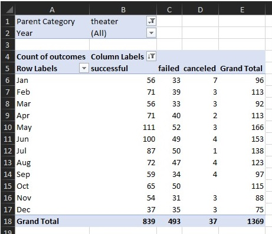
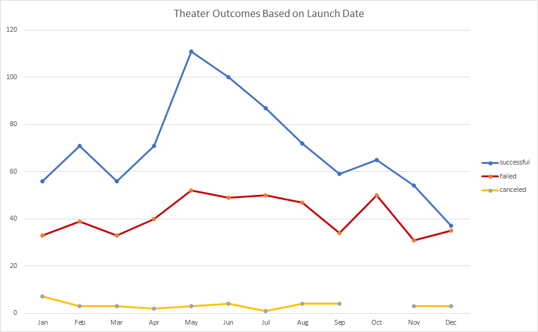
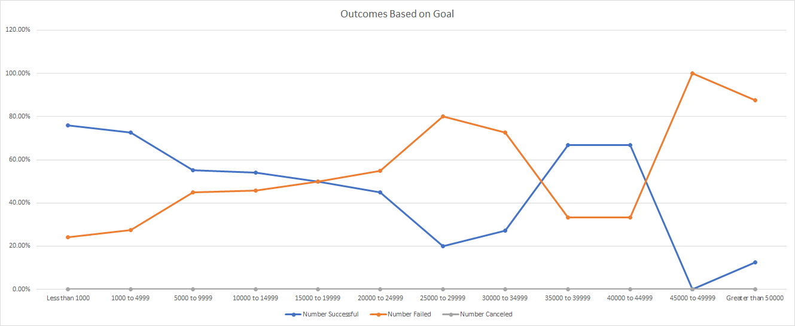

# Kickstarter-Analysis
<!--- Performance analysis on Kickstarter data --->

## Overview of Project

We have been asked by Louise to help determine how to to setup a Kickstarter project to help fund her play *Fever*. Louise’s play *Fever* came close to its fund-raising goal in it's first attempt at funding and Louise would like to try again to get the project fully funded. Her request to us to help her understand how different campaigns fared in relation to their launch dates and their funding goals.

This project will take data from Kickstarter and analyze it to help Louise in determining how to run her next funding campaign. We will look at the two following questions:

- Does when the funding campaign is started affect success of the campaign? 
- How does the funding goal affect the success of a campaign? 
  

This project looked at the data from over 4000 project from Kickstarter from 2009 to 2017. The data includes the following about a project:

- The project name
- A description of the project
- The funding goal for the project
- The pledged amount for the project
- The start and end dates of the pledge campaign
- The outcome of the funding campaign
- What country the project will take place in around the world
- The number of backers a project campaign garnered
- The type of project looking for funding 

## Analysis and Challenges

### Analysis of Outcomes Based on Launch Date

The first analysis performed was to see if the launch date of the funding campaign affects the success of the campaign.

To perform this analysis all of the dates for the start of a campaign were analyzed. The projects were placed into buckets based on the month that the funding campaign started. Those buckets were then broken down by project outcome to determine how many successful, failed and canceled projects there were.

### Analysis of Outcomes Based on Goals
The second analysis performed was to see if the goal amount of the funding campaign affected the success of the funding of the campaign.

To perform this analysis all of the funding goals of the projects were analyzed. The projects were placed into buckets based on the funding goal. Those buckets were then broken down by project outcome to determine how many successful, failed and canceled projects there were. 

### Challenges and Difficulties Encountered
There were two major challenges with the analysis of this data set:

1. All of the dates in the system needed to be converted from a Unix format to a usable format. Unix timestamps are represented by the number of seconds since midnight of January 1, 1970. Once converted to a format that was in a readable format, the dates then needed to be further processed to aid in the analysis by month of launch date.
2. The data describing the project type was not stored in a usable fashion. The data had both the project type and the project subcategory in the same field as a concatenated text field. With some text manipulation to separate these two parts, the analysis was made much easier.  

## Results

###Outcomes based on Launch Date?
<!--- - What are two conclusions you can draw about the Outcomes based on Launch Date?  -->

After analyzing the data set by launch date and graphing out the results of the analysis, a couple of things become obvious.

1. If you want to have project funded you should attempt to run the funding campaign during the summer months. There is a much better chance of success if the campaign is started between May and September.

2. Don't start your funding campaign during the holiday season. The months from October to January are the worst time to start a funding campaign.

###Outcomes based on Funding Goal?
<!--- What can you conclude about the Outcomes based on Goals?  -->

After analyzing the data set by funding goal, one major conclusion became obvious.For a funding campaign to have a chance at being success  

###Limitations of the current data set
<!--- What are some limitations of this dataset?  -->

This data set is a limited set of data from Kickstarter. it is representative for the years 2009-2017. 

###Other possible analysis supported by the data
<!---  What are some other possible tables and/or graphs that we could create?  -->

This data set would support a number of other analysis to help make sure a funding campaign were successful.

1. The success rate of a funding campaign based on the length of the campaign. Does a longer campaign help or hurt the chances of a campaign being successful?
2. Does the country you run the campaign in affect the probability of success of a funding campaign?
3. Does the type of project affect the probability of success of a funding campaign?

 